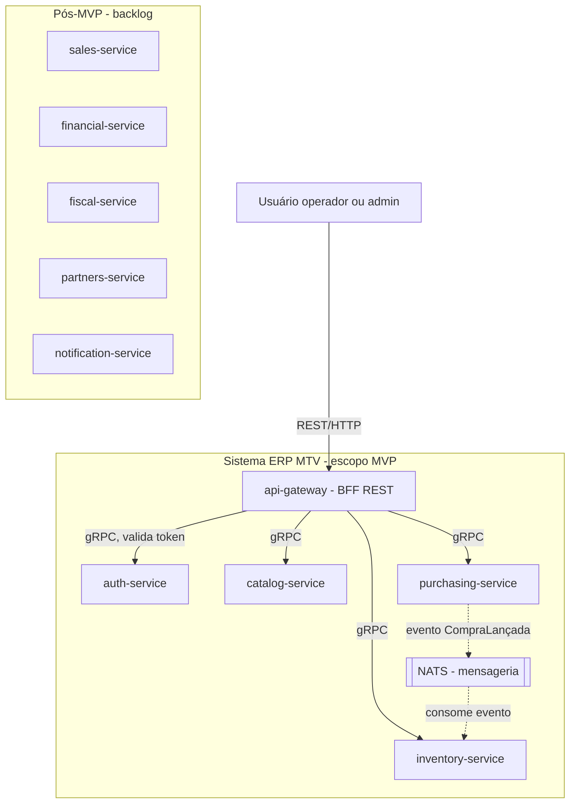

# Diagrama de contexto — ERP MTV

> Bounded contexts do MVP e como se relacionam. Baseado em `docs/requisitos.md` e no TODO (Fase 1 — "Definir os bounded contexts do MVP").

### Notas

- **gateway (BFF)** é o único ponto de entrada REST — nunca tem lógica de negócio própria, só traduz REST → gRPC e valida token com o `auth-service` antes de repassar (ver Fase 5 do TODO).
- **auth-service, catalog-service, purchasing-service, inventory-service**: cada um com seu próprio banco (database-per-service, RNF3) — não desenhei os bancos individualmente pra não poluir, mas vale lembrar que não existe FK física entre eles.
- **Fornecedor e cliente** vivem dentro de `catalog-service` (suposição registrada em `docs/requisitos.md`, ainda não confirmada de vez — revisitar se um dia `partners-service` sair do backlog).
- A seta `purchasing-service → NATS → inventory-service` representa o estado **alvo** do sistema (Fase 6 do TODO). No MVP inicial (Fase 4), essa comunicação começa como uma chamada gRPC síncrona direta entre os dois serviços, e só migra pra evento assíncrono via NATS mais adiante — o diagrama já mostra pra onde a arquitetura caminha, não o primeiro incremento.
- **Pós-MVP** (sales, financial, fiscal, partners, notification) documentado como caixa separada, sem seta ainda — são bounded contexts que existem no raciocínio de negócio (`docs/requisitos.md` já tem RF-VEN/RF-FIN pra eles) mas não têm integração desenhada até esse ponto do projeto.
