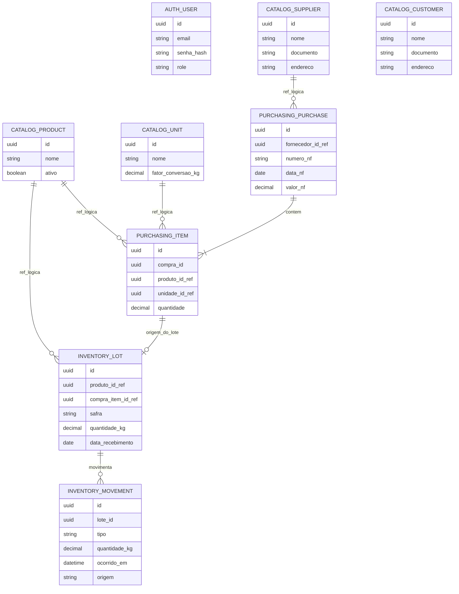

# Modelo de dados — ERP MTV

> ER simplificado dos 4 serviços de domínio do MVP (auth, catalog, purchasing, inventory). Prefixo no nome da entidade indica o serviço dono — não existe FK física entre serviços diferentes, só entre entidades do mesmo serviço (ADR-0002). Relações entre serviços estão marcadas como referência lógica (ID guardado, validado pela aplicação, não pelo banco).

### Notas

- **`CATALOG_UNIT.fator_conversao_kg`**: imutável após criado (ADR-0005) — correção sempre cria uma unidade nova, nunca edita a existente.
- **`INVENTORY_LOT`**: nunca existe sem produto e sem origem — todo lote nasce de um item de compra (`PURCHASING_ITEM`), reforçando a premissa "sem lote não existe estoque" (ADR-0006). `compra_item_id_ref` é a referência lógica que sustenta a rastreabilidade de origem (RF-INV-5).
- **`INVENTORY_MOVEMENT.tipo`**: entrada (recebimento), saída (venda), ajuste (RF-INV-4) ou troca (RF-FIN-7) — todas sempre vinculadas a um lote existente, nunca soltas.
- **Linhas "ref_logica"**: representam FK lógica entre serviços diferentes (ID guardado, validado pela aplicação — ver ADR-0002), não uma constraint de banco de verdade. Só as duas relações dentro do mesmo serviço (`PURCHASING_PURCHASE`→`PURCHASING_ITEM` e `INVENTORY_LOT`→`INVENTORY_MOVEMENT`) são FK física de verdade.
- **`AUTH_USER.role`**: string simples (`admin` ou `operador`) em vez de tabela `Role` separada — não há necessidade de papéis dinâmicos/configuráveis no MVP (RF-AUTH-1/RN1 em `docs/requisitos.md`), uma tabela à parte seria complexidade sem uso real agora. Revisitar se isso mudar.
- **Fornecedor e cliente vivem em `catalog-service`**: mesma suposição já registrada em `docs/contexto-c4.md`, ainda não confirmada de vez.
